# var  (ES6이전)

- 재할당, 재선언 가능
- 호이스팅
  - 선언 하는 순간 undefined를 할당해 초기화
  - 변수 선언 이전의 위치에서 접근 시 undefined를 반환
- 함수 스코프
  - 함수 바깥에서 접근 불가능

# let (ES6 이후)

- 재할당은 가능하지만 재선언 불가능
- 선언하기전에 호출하면 에러
- 블록 스코프
  - 함수, if,for,while,try/catch 등을 지역 스코프로 인정해서 전역 변수는 변하지 않는다.
- 변수는 let으로 사용

# const (ES6 이후)

- 재할당,재선언 불가능
  - 객체인 경우 객체 안의 속성은 재할당 가능
- 선언할 때 초기화를 동시에 진행해야 함 ( 값 넣기)
- 블록 스코프
  - 함수, if,for,while,try/catch 등을 지역 스코프로 인정해서 전역 변수는 변하지 않는다.
- 상수는 웬만하면 const로 이용 

# 세미콜론

- JS는 세미콜론을 선택적으로 사용 가능
- 세미콜론이 없을 경우 ASI에 의해 자동으로 삽입
  - ASI (Automatic Semicolon Insertion)

# 변수 & 식별자

- 식별자는 변수를 구분할 수 있는 변수명
- 반드시 문자, 달러($), 밑줄(_)로 시작
- 대소문자를 구분, 클래스명 외에는 모두 소문자로 시작
- 예약어 사용 불가능
  - if, for, case...
- 카멜 케이스
  - 변수,객체,함수에 사용
  - camelCase - 두번째 단어의 첫글자부터 대문자
- 파스칼 케이스
  - PascalCase - 모든 단어의 첫번째 글자를 대문자
  - 클래스, 생성자에 사용
- 대문자 스네이크 케이스
  - 상수에 사용
    - 변경될 가능성이 없는 값
  - SNAKE_CASE - 모든 글자 대문자, 단어 사이에 언더스코어

- 선언
  - 변수를 생성하는 행위, 시점
- 할당
  - 선언된 변수에 값을 저장하는 행위, 시점
- 초기화
  - 선언된 변수에 처음으로 값을 저장하는 행위, 시점

# 데이터 타입

- 원시 타입 ( Primtive)
  - 숫자, 문자, 논리,, undefined, null...
    - 숫자
      - Infinity(무한), -Infinity(음의 무한), NaN(계산 불가능한 경우)
    - 문자
      - 텍스트 데이터, 작은 따옴표 사용 가능
      - 템플릿 리터럴
        - ES6부터 지원
        - backtick(``)으로 표현
        - ${expression}형태로 표현식 삽입
    - undefined
      - 변수의 값이 없음을 나타냄
      - 직접 값을 할당하지 않으면 JS가 자동으로 undefined  할당함
      - typeof 연산자의 결과로 undefined 
    - null
      - 변수의 값이 없음을 의도적으로 표현
      - 개발자가 의도적으로 필요에 의해 할당
      - typeof 연산자의 결과로는 객체로 표현(ECMA명세로는 원시타입)
  - 객체가 아닌 기본 타입
  - 변수에 해당 타입의 값이 담김
  - 다른 변수에 복사할 때 실제 값이 복사됨
  - 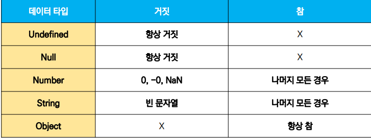
- 참조 타입 ( Referencne)
  - Objects, Array, Function
  - 객체 타입의 자료형
  - 변수에 해당 객체의 참조 값이 담김
  - 다른 변수에 복사할 때 참조 값이 복사됨

# 연산자

- 비교 연산자
  - 알파벳 
    - 오름차순으로 우선순위( 'z' > 'a' )
    - 소문자가 대문자보다 우선순위( 'a' > 'A' )
- 동등 비교 연산자 (==)
  - 암묵적 타입 변환을 통해 타입을 일치시킨 후 비교 (웬만하면 확실한 비교를 하는게 좋음)
  - 모두 객체일 경우 메모리의 같은 객체를 바라보는지 판별
  - 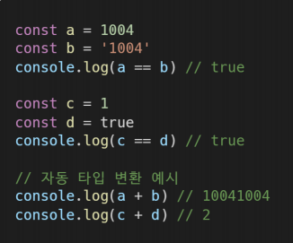

- 일치 비교 연산자 (===)
  - 엄격한 비교가 이루어짐 ( 암묵적 타입 변환X)
  - 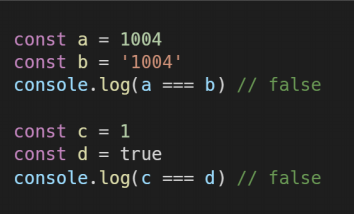
- 논리 연산자
  - and : &&
  - or : ||
  - not : !
  - 단축 평가 지원
- 삼항 연산자
  - 세 개의 피연산자를 사용하여 조건에 따라 값 반환
  - 조건식이 참이면 콜론 앞의 값,  거짓이면 클론 뒤의 값

# 조건문

- if statement (if, else if, else)
  - 결과값을 Boolean 타입으로 변환
  - 블록 스코프 생성
  - 조건은 소괄호 안에 작성
  - 실행할 코드는 중괄호 안에 작성
  - 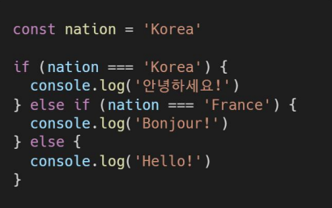
- switch statement
  - 결과값이 어느 값에 해당하는지 판별
  - 표현식의 결과값과 case문의 오른쪽 값을 비교
  - break, default 문은 선택적으로 사용 가능
  - break문이 없는 경우 break문을 만나거나 default문을 실행할 때까지 다음 조건문 실행
  - 블록 스코프 생성
  - 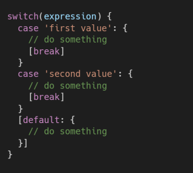

# 반복문

- while 
  - 조건 - 소괄호
  - 실행 코드 - 중괄호
  - 블록 스코프
  - 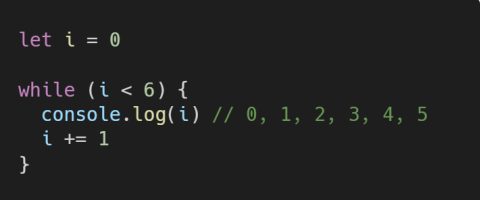

- for
  - 세미콜론으로 구분
  - Initialization - 최초 반복문 진입시 1회만 실행
  - condition - 매 반복 시행 전 평가
  - expression - 매 반복 시행 이후 평가
  - 블록 스코프
  - 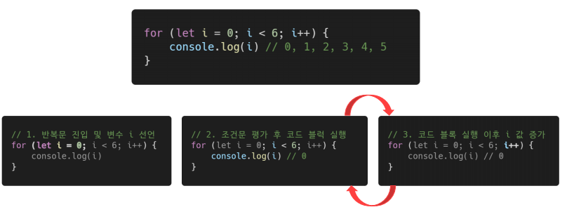
- for .. in
  - 객체의 속성을 순회할 때 사용
  - 순서를 보장하지 않기 때문에 배열 순회는 권장 x
  - 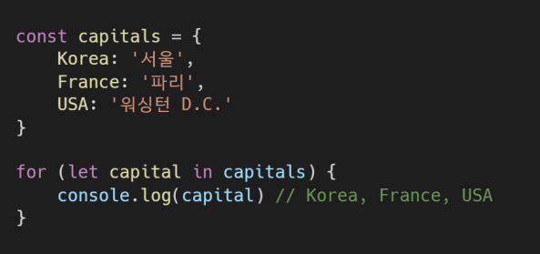

- for ... of
  - 반복 가능한 객체를 순회하며 값을 꺼냄 (Iterable)
  - 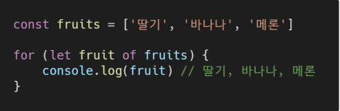

- in & of 차이
  - 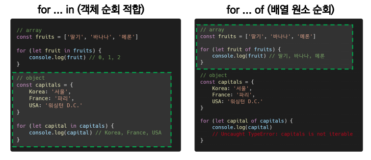
  - for .. in 에서 iterable을 순회하면 값이 아닌 인덱스를 출력
  - for .. of 에서 객체를 순회하면 에러가 난다

# 함수

- 선언식
  - 타입은 function(객체)
  - var 변수 처럼 호이스팅 발생(정상 작동)
  - 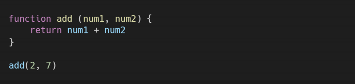
- 표현식
  - 표현식 내에서 함수를 정의하는 방식
  - 타입은 function(객체)
  - **호이스팅 시 에러 발생**
    - const 대신 var를 써도 undefined이기 때문에 다른 에러가 발생
  - 익명 함수 - 이름이 없는 함수
  - 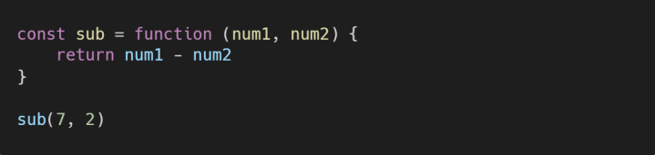
- 기본인자
  - **인자 작성 시 '=' 문자 뒤 기본 인자 선언 가능**
  - 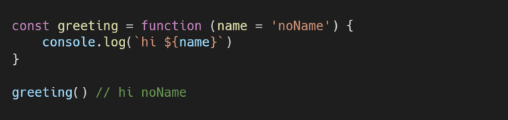

# Arrow Function

- function 키워드 생략 가능
- **매개변수가 단 하나라면 '( )' 도 생략 가능**
- **바디가 표현식 하나라면 '{ }' 와 return 도 생략 가능**

- 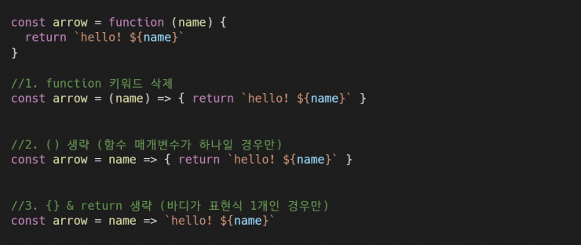

# Arrays

- 키와 속성들을 담고 있는 참조 타입의 **객체**
- **순서를 보장**
- **대괄호를 이용하여 생성, 0을 포함한 양의 정수 인덱스로 특정 값에 접근**
- **array.length 형태로 길이 구함**
- 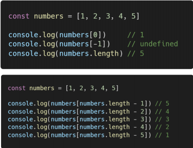
- 기본 배열 조작 메서드
  - 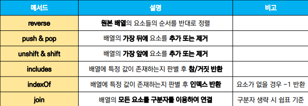

- 배열을 순회하며 특정 로직을 수행하는 메서드
  - 인자로 **callback 함수**를 받음
  - 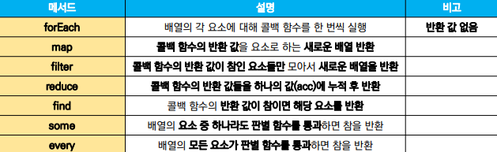

- forEach
  - 배열의 각 요소에 대해 콜백 함수를 한 번씩 실행 ( 반환 값 X)
  - element - 요소
  - index - 요소의 인덱스
  - array -  배열 자체
  - 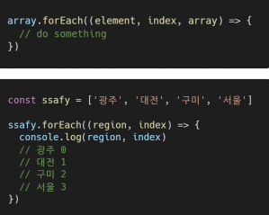

- map

  - 콜백 함수의 반환 값을 요소로 하는 새로운 배열 반환
  - 기존 배열 전체를 다른 형태로 바꿈
  - 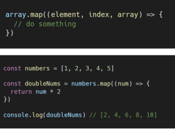

- filter

  - 콜백 함수의 반환 값이 참인 요소들만 모아서 새로운 배열을 반환
  - 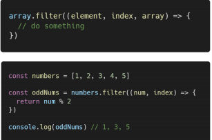

- reduce

  - **콜백 함수의 반환 값들을 하나의 값에 누적 후 반환**
  - **acc - 이전 callback 함수의 반환 값이 누적되는 변수**
  - **InitialValue** - 최초 callback 함수 호출 시 acc에 할당되는 값, **선택적으로 설정 가능 , 직접 제공하지 않으면 배열의 첫번째 값 사용**

  - 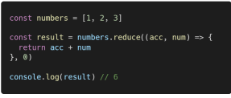

- find

  - 콜**백 함수의 반환 값이 참이면 해당 요소를 반환**
  - **찾는 값이 배열에 없으면 undefined 반환**

  - 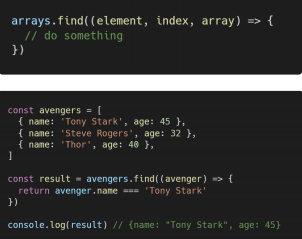

- some 
  - **요소 중 하나라도 판별 함수를 통과하면 참을 반환**
  - **모든 요소가 통과하지 못할 때 거짓 반환**
  - **빈 배열은 항상 거짓**
  - 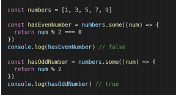

- every
  - **모든 요소가 판별 함수를 통과하면 참 반환**
  - **하나라도 통과하지 못하면 거짓 반환**
  - **빈 배열은 항상 참**
  - 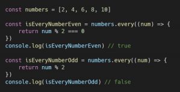

# 객체

- 속성의 집합
- 중괄호 내부에 key : value로 표현
- key는 문자열 타입만 가능
  - **문자열에 구분자가 있는 경우 따옴표로 묶어서 표현**

- value는 모든 타입 가능
- 객체 요소 접근은 점, 대괄호로 가능
  - **key에 구분자가 있는 경우는 대괄호로만 접근 가능**

- 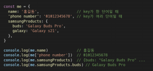
- 속성명 축약
  - **key와 할당하는 변수의 이름이 같으면 축약 가능**
  - 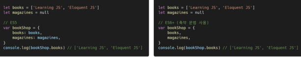
- 메서드명 축약
  - 메소드 선언 시 function 키워드 생략 가능
  - 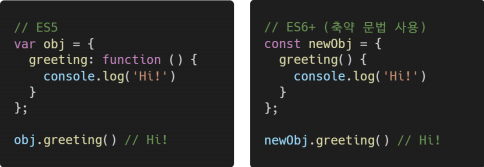
- 계산된 속성
  - 객체를 정의할 때 key의 이름을 표현식을 이용하여 동적으로 생성 가능
  - 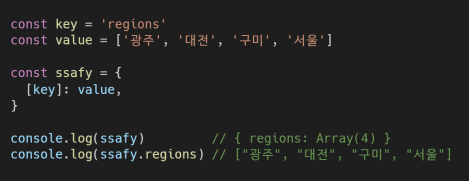
- 구조 분해 할당
  - 배열, 객체를 분해하여 속성을 변수에 쉽게 할당할 수 있는 문법
  - 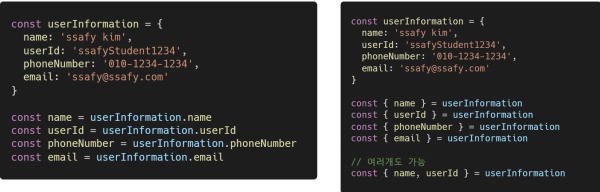
- JSON
  - key--value 쌍의 형태로 데이터를 표기하는 언어 독리비적 표준 포맷
  - 객체와 유사하게 생겼지만 실제로는 **문자열 타입**
    - JS의 객체로써 조작하기 위해서 **Parsing 필수**
  - 자바스크립트에서는 JSON을 조작하기 위한 두 가지 내장 메서드 제공
    - JSON.parse()
      - JSON => JS 객체
    - JSON.stringify()
      - JS객체 => JSON

