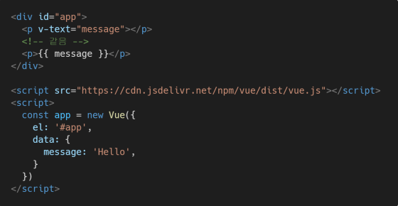
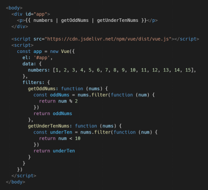

# 프로젝트 생성 -> 실행

- `npm install -g @vue/cli`: vueCli 설치
  - vue CLI가 설치되어야 vue create로 프로젝트 생성 가능
- `vue create <프로젝트 이름>` : 원하는 프로젝트 이름으로 생성
- `cd/<프로젝트 폴더 이름>` : cd -> git을 현재 폴더위치로 변경시켜줌
- `vue add router` : router 설치
- `npm i lodash` : lodash  설치
  - `import _ from 'lodash'`
- `npm run serve` : Vue 서버 실행

# Vue

- SPA(Single Page Applcation) 지원

# SPA (Single Page Application)

- 단일 페이지로 구성되어 처음에만 페이지를 받아오고 동적으로 DOM을 구성
- UX 향상 -> 모바일 사용의 증가로 트래픽의 감소, 속도, 사용성의 향상이 중요
- MPA를 쓰다가 모바일 최적화의 필요성 때문에 CSR, SPA가 등장

# CSR (Client Side Rendering)

- 최초 요청 시 서버에서 빈 문서 응답
- 클라이언트에서 데이터를 요청해 데이터를 받아 DOM을 렌더링
- SSR보다 초기 전송되는 페이지 속도는 빠르지만 서비스에 필요한 데이터를 클라이언트가 추가로 요청해서 재구성해야 하기 때문에 전체적인 페이지 완료 시점은 SSR보다 느림
- SPA가 사용하는 렌더링 방식

- **장점**

  - 서버 - 클라이언트 간 트래픽 감소 : 필요한 모든 정적 리소스를 최초 한번 다운

  - UX 향상 : 전체 페이지를 다시 렌더링하지 않고 변경되는 부분만 갱신

- **단점**

  - SEO 문제가 발생 할 수 있음

# SSR (Server Side Rendering)

- 서버에서 사용자에게 보여줄 페이지를 모두 구성해서 보여주는 바아식
- 서버를 이용해서 구성하기 때문에 CSR보다 구성 속도는 늦지만 콘텐츠 구성 완료 시점은 빨라짐

- **장점**
  - 초기 로딩 속도가 빠르기 때문에 사용자가 컨텐츠 빨리 볼 수 있음
  - SEO 가능
- **단점**
  - 모든 요청에 새로고침이 되기 때문에 UX 떨어짐
  - 상대적으로 요청 횟수가 많아져 서버 부담이 증가

# SEO ( Search Engine Optimization)

- 웹 페이지 검색엔진이 자료를 수집하고 순위를 매기는 방식에 맞게 웹페이지를 구성해서 검색 결과의 상위에 노출될 수 있도록 하는 작업
- 인터넷 마케팅 방법 중 하나
- 구글 등장 이후 검색엔진들이 컨텐츠의 신뢰도를 파악하는 기초 지표로 사용
  - 다른 웹 사이트에서 얼마나 인용되었는가
  - 타 사이트에 인용되는 횟수를 늘리는 방향으로 최적화
- **문제 대응 **
  - Vue, React 등 SPA 프레임워크는 SSR을 지원하는 SEO 대응 기술이 존재 ( 선별적 SEO 대응 기능)
  - Nuxt.js
    - Vue 응용 프로그램을 만들기 위한 프레임워크
    - SSR 지원
  - Next.js
    - React 응용 프로그램을 만들기 위한 프레임워크
    - SSR 지원

# SPA with SSR

- CSR과 SSR을 적절히 사용
  - 대부분은 서버에서 완성된 HTML을 제공 (SSR)
  - 특정 요소만 AJAX를 활용한 비동기요청으로 필요한 데이터를 클라이언트에서 서버로 직접 요청 보내 받아오고 JS를 활용해 DOM 조작(CSR)

# Vanilla JS vs Vue.js

- Vanilla JS
  - 데이터를 변경하려면 그 데이터가  포함된 컴포넌트의 데이터를 일일히 변경해줘야함
  - 모든 요소를 선택해서 이벤트를 등록하고 값을 변경해줘야 함
- Vue.js
  - DOM과 data가 연결되어 있으므로 data 값만 변경시켜주면 알아서 변환됨.
  - 데이터 로직 작성 -> DOM 작성 -> 완성

# MVVM Pattern

- 애플리케이션 로직을 UI로부터 분리하기 위해 설계
- 구성 요소
  - Model -> Plain JS Objects : {key:value}
  - View -> DOM : HTML 형식
  - View Model -> DOM & Data 중개자 ( 모든 Vue Instance === Vue Component )

# Vue Instance

- 모든 Vue 앱은 Vue 함수로 새 인스턴스를 만든다
- Vue 인스턴스 생성할 때 Options 객체를 전달해야 함
- Options/DOM - 'el'
  - Vue 인스턴스에 연결 할 기존 DOM 엘리먼트가 필요
  -  CSS 선택자 문자열 or HTML Element로 작성
  - new를 이용한 인스턴스 생성때만 사용
  - 

- Options/Data - 'data'

  - Vue 인스턴스의 데이터 객체

  - Vue 앱의 상태 데이터를 정의하는 곳

  - Vue template에서 interpolation(중괄호)을 통해 접근 가능

  - v-bind(:), v-on(@) 같은 디렉티브에서도 사용 가능

  - Vue 객체 내 다른 함수에서 this 키워드로 접근 가능

  - data에서 화살표 함수 사용 x 

    - 화살표 함수가 부모 컨텍스트를 바인딩하기 때문에 this가 Vue 인스턴스를 가리키지 않음

    

- Options/Data - 'Methods'

  - Vue 인스턴스에 추가할 메서드

  - Vue template에서 interpolation(중괄호)을 통해 접근 가능

  - v-on(@) 같은 디렉티브에서도 사용 가능

  - Vue 객체 내 다른 함수에서 this 키워드로 접근 가능

  - method에서 화살표 함수 사용 x

    - 화살표 함수가 부모 컨텍스트를 바인딩하기 때문에 this가 Vue 인스턴스를 가리키지 않음

    

# Template Syntax

- Interpolation(보간법)
  - 
- Directive(디렉티브)
  - 
- V-text
  - 엘리먼트의 textContent 업데이트
  - interpolation 문법 = V-text
  - 
- V-html
  - 엘리먼트의 innerHTML 업데이트 -> XSS 공격에 취약
  - 임의의 사용자로부터 입력 받은 내용은 **절대 사용 금지**
  - 
- v-show
  - 조건부 렌더링
  - 엘리먼트는 항상 렌더링 되고 DOM에 있지만 display CSS 속성만 토글 ( 토클 자주할 때 유용)
  - 
- v-if , v-else-if, v-else
  - 조건부에 따라 블록을 렌더링
  - 디렉티브 표현식이 true 일때만 렌더링
  - 토글하는 동안 삭제되고 다시 작성되고 반복 ( 토글을 자주 하지 않는 경우에 사용)
  - 
- v-for
  - item in items 구문 사용 ( item 위치의 변수 or key를 각 요소에서 사용 가능)
  - 반드시 key 속성을 각 요소에 작성
  - 가능한 v-if와 v-for를 동시에 사용하지 말 것 (v-for가 v-if 보다 우선순위 높음)
  - 
- v-on(@)
  - 엘리먼트에 이벤트 리스너를 연결
  - 
- v-bind(:)
  - HTML 요소의 속성에 Vue의 상태 데이터를 값으로 할당
  - Object형태로 사용 가능 -> value의 값이 True인 key가 class 바인딩 값으로 할당
  - 
- v-model
  - HTML form 요소의 값과 data를 양방향 바인딩!
  - .lazy
    - input 대신 change 이벤트 이후에 동기화
  - .number
    - 문자열을 숫자로 변경
  - .trim
    - 입력에 대한 trim을 진행
  - 
- Options/Data - 'computed'
  - 데이터를 기반으로 계산된 속성
  - 함수의 형태로 정의하지만 함수가 아닌 함수의 반환 값이 바인딩 됨 (반드시 반환 값이 있어야 함)
  - 종속된 대상을 따라 캐싱 됨
  - **종속된 대상이 변경될 때만 함수를 실행**
  - 아무 곳에도 의존하지 않는 computed 속성의 경우 절대로 업데이트 X
  - 
- Computed & Method
  - 최종 결과에 대해 두 가지 접근 방식은 서로 동일
  - 차이점
    - computed 속성은 종속 대상을 따라 캐싱
    - computed는 종속된 대상이 변경되지 않는 한 computed에 작성된 함수를 여러 번 호출해도 계산을 다시 하지 않고 계산되어 있던 결과를 반환
    - method는 호출하면 렌더링을 다시 할 때 마다 항상 함수 실행
- Options/Data - 'watch'
  - 데이터를 감시
  - 데이터에 변화가 일어났을 때 실행되는 함수
- Computed & Watch
  - computed
    - 특정 데이터를 직접적으로 사용/가공하여 다른 값으로 만들 때 사용
    - 계산해야 하는 목표 데이터를 정의하는 방식
    - **선언형 프로그래밍**
      - 계산해야 하는 목표 데이터를 정의
    - 특정 값이 변동하면 특정 값을 새로 계산해서 보여준다
  - watch
    - 특정 데이터의 변화 상황에 맞춰 다른 data가 바뀌어야 할 때 사용
    - **명령형 프로그래밍**
      - 데이터가 바뀌면 특정 함수를 실행해!
    - 특정 값이 변동하면 다른 작업을 한다
    - 특정 대상이 변경되었을 때 콜백 함수를 실행 시키기 위한 트리거
- Options/Assets - 'filters'
  - 텍스트 형식화를 적용할 수 있는 필터
  - interpolation 혹은 V-bind를 이용할 때 사용 가능
  - JS 표현식 마지막에 "|"와 함께 추가해야 함
  - 체이닝 기능
  - 
- 